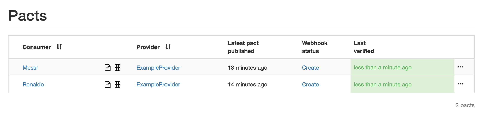

## Theory
- [Testing micro services - the sane way](https://medium.com/@copyconstruct/testing-microservices-the-sane-way-9bb31d158c16)
- [Fowler - Testing Strategies in Microservice Architecture](https://martinfowler.com/articles/microservice-testing/?fbclid=IwAR3X3G8RAWL1W6SUTjXc3yPpfHZ3iYq1rgXcLRKctXfsyxs_8JQV9J7Dbd4)
- [Fowler - Contract test](https://www.martinfowler.com/bliki/ContractTest.html)
- [Fowler - customer driven contract tests](https://martinfowler.com/articles/consumerDrivenContracts.html)
- [7 reasons for consumer driven contracts](https://reflectoring.io/7-reasons-for-consumer-driven-contracts/)
- [Pact at John Lewis & Partners](https://medium.com/john-lewis-software-engineering/consumer-driven-contract-testing-a-scalable-testing-strategy-for-microservices-3f2b09f99ed1)
- [Oracle - How to Test Java Microservices with Pact](https://blogs.oracle.com/javamagazine/how-to-test-java-microservices-with-pact)
- [YouTube talk](https://www.youtube.com/watch?v=nQ0UGY2-YYI)

### Contract test great introduction
- [Introduction](https://kreuzwerker.de/post/introduction-to-consumer-driven-contract-testing)
- [Writing tests](https://kreuzwerker.de/post/writing-contract-tests-with-pact-in-spring-boot)
- [Continuous Integration](https://kreuzwerker.de/post/integrating-contract-tests-into-build-pipelines-with-pact-broker-and)
- [Lessons Learned](https://kreuzwerker.de/post/contract-tests-lessons-learned)

### Testing message queues with Pact

- [Pact blog 1](https://dius.com.au/2017/09/22/contract-testing-serverless-and-asynchronous-applications/)
- [Pact blog 2](https://dius.com.au/2018/10/01/contract-testing-serverless-and-asynchronous-applications---part-2/)
- [Reflectoring blog](https://reflectoring.io/cdc-pact-messages/)

### Pact and Node JS
- [Recommended guide](https://medium.com/@liran.tal/a-comprehensive-guide-to-contract-testing-apis-in-a-service-oriented-architecture-5695ccf9ac5a)
- [Reflectoring blog](https://reflectoring.io/pact-node-provider/)
- [Risingstack blog 1](https://blog.risingstack.com/consumer-driven-contract-testing-with-pact/)
- [Risingstack blog 2](https://blog.risingstack.com/advanced-contract-testing-pact-verification-with-pattern-matching/)

## Practice

### 1a. Setup Pact Broker automatically

`./gradlew setupPactBroker`

- [localhost:9292](http://localhost:9292)

Create provider:

`./gradlew createProvider`

### 1b. Setup Pact Broker manually
[Full guide](https://github.com/pact-foundation/pact-broker-docker)

`git clone https://github.com/pact-foundation/pact-broker-docker.git`

`cd pact-broker-docker`

`docker-compose up`

- [localhost:9292](http://localhost:9292)

Create provider:

`curl -v -XPOST -H "Content-Type: application/json" -d "{\"name\": \"ExampleProvider\"}" http://localhost:9292/pacticipants`

### 2. Build and Publish Pacts
`./gradlew :example-consumer-ronaldo:build`

`./gradlew :example-consumer-ronaldo:pactPublish`

`./gradlew :example-consumer-messi:build`

`./gradlew :example-consumer-messi:pactPublish`

### 3. Verify pacts
`./gradlew :example-provider:build`

`./gradlew :example-provider:pactVerify -PrequestVerification=true`

Publish results:

`./gradlew :example-provider:pactVerify -PrequestVerification=true -Ppact.verifier.publishResults='true'`

### 4. Cleanup

- Kill task setupPactBroker
- Kill dockers `./killDockers.sh`

### More playgrounds (a bit dated)
- https://github.com/Mikuu/Pact-JVM-Example
- https://github.com/DiUS/pact-workshop-jvm
- https://github.com/RisingStack/pact-example (Node)
